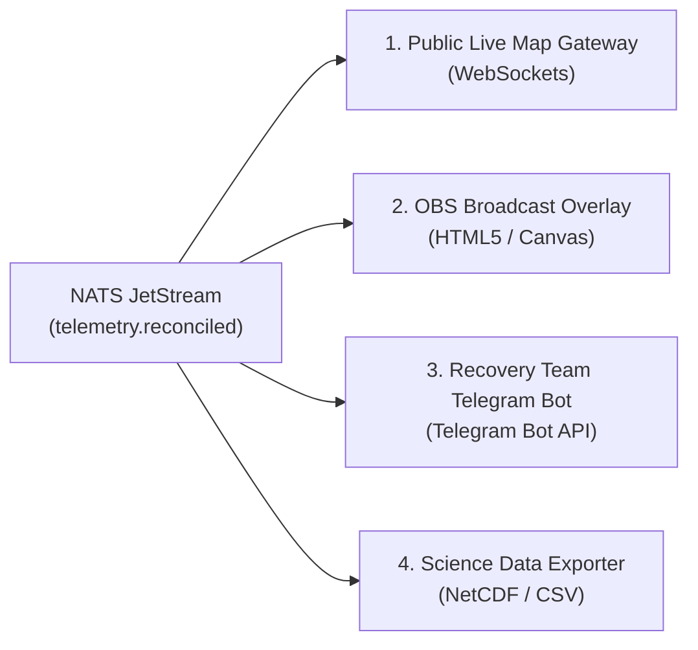

# Downstream Consumer Microservices

## 1. Ecosystem Overview

Downstream services subscribe to the [NATS JetStream Message Broker](/cloud-platform/message-broker) to deliver flight telemetry to different end-user platforms without touching the core radio ingest pipeline.

---

## 2. Microservice Profiles

### 1. Public Live Map Gateway (`services/cloud-distribution`)
- **Technology**: Go WebSocket Gateway.
- **Role**: Broadcasts real-time JSON coordinates and altitude telemetry to public web visitors without placing load on the central flight database.

### 2. OBS Video Stream Overlay
- **Technology**: Lightweight HTML5/Canvas rendering engine.
- **Role**: Renders live altitude gauges, ascent/descent velocity meters, and GPS breadcrumb trails as a transparent browser source for live YouTube/Twitch mission streams.

### 3. Recovery Team Telegram Bot (`services/cloud-telegram-bot`)
- **Technology**: Go / Python worker integrated with the **Telegram Bot API**.
- **Role**: 
  - Dispatches automated flight event alerts (e.g. launch confirmation, apogee/burst altitude reached, parachute descent phase, ground touchdown).
  - Sends live GPS coordinates and clickable Google Maps / Apple Maps navigation pins directly into the field recovery team's Telegram group.
  - Supports interactive queries (e.g., `/status`, `/eta`, `/coords`, `/predict`).

### 4. Scientific Archive Exporter
- **Technology**: Python data pipeline.
- **Role**: Automatically packages all recorded atmospheric and flight metrics into standard scientific data formats (NetCDF, CSV, GeoJSON) upon mission completion.
