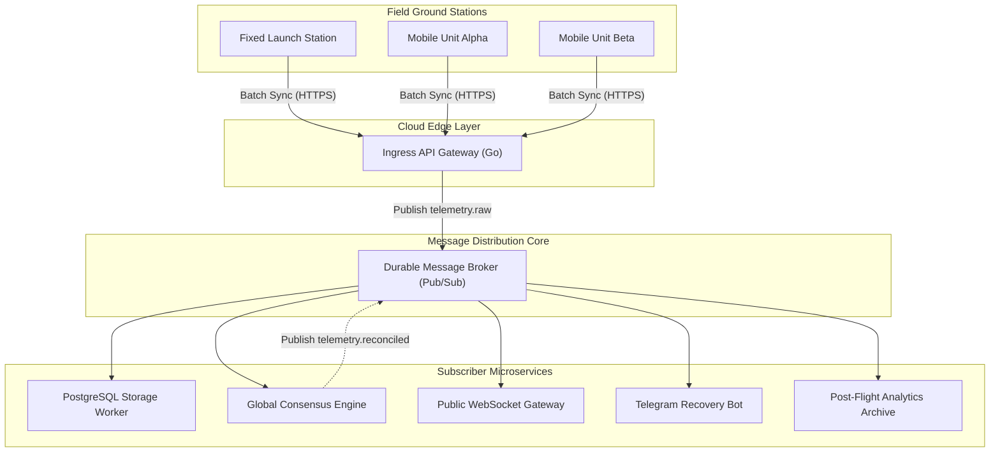

# Cloud Platform Architecture

## 1. Role of the Cloud Tier

The Cloud Platform aggregates telemetry from multiple field ground stations, resolves duplicate packet diversity, and distributes live flight feeds to external consumers (public live trackers, broadcast video overlays, scientific data dumps, and Telegram recovery alert bots).

---

## 2. Decoupled Microservice Architecture

Every downstream consumer runs as an independent subscriber process connected to the message broker:

| Component | Subsystem | Responsibility |
|---|---|---|
| **Ingress Gateway** | [Station Sync Protocol](./station-sync.md) | Authenticates field stations, receives batched packet payloads, rate-limits requests, and publishes to the message broker. |
| **Message Broker** | [NATS JetStream Message Broker](./message-broker.md) | High-performance NATS pub/sub topic routing with 72-hour stream persistence. |
| **Global Reconciliation** | [Consensus Algorithm](./reconciliation.md) | Compares simultaneous multi-station packet copies to select the highest-SNR consensus frame. |
| **Central Persistence** | [Database Schema & DDL](/specs/database-schema) | Writes incoming raw packets and reconciled consensus telemetry into a central [PostgreSQL](/guide/glossary#postgresql) database. |
| **Downstream Services** | [Consumer Services](./downstream-services.md) | Public tracking map, OBS broadcast overlay, Telegram recovery bot, and scientific archiving. |
