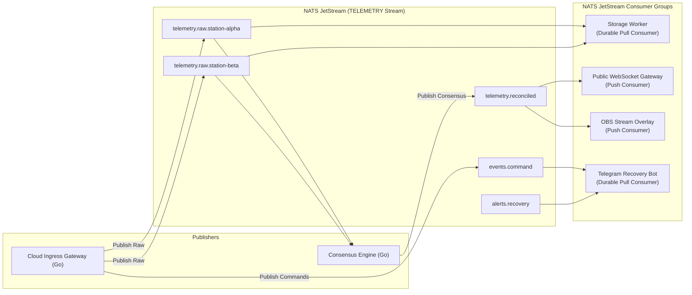
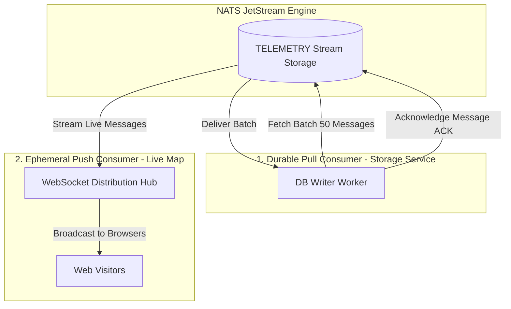

# NATS JetStream Message Broker

## 1. Role of NATS in the Cloud Platform

The cloud distribution layer uses **[NATS JetStream](/guide/glossary#nats)** as its central message broker. Written in Go, NATS provides sub-millisecond pub/sub routing, built-in stream persistence, and horizontal consumer scaling with a tiny memory footprint (<20MB RAM).



---

## 2. NATS JetStream Stream Configuration

The central telemetry stream (`TELEMETRY`) is defined as follows:

```json
{
  "name": "TELEMETRY",
  "subjects": [
    "telemetry.raw.>",
    "telemetry.reconciled",
    "events.>",
    "alerts.>"
  ],
  "retention": "limits",
  "max_age": 259200000000000,
  "storage": "file",
  "replicas": 1,
  "discard": "old",
  "duplicate_window": 120000000000
}
```

### Key Stream Attributes:
- **`max_age: 72 Hours`**: Retains flight telemetry for 3 full days. If any subscriber process restarts during pre-flight or post-flight analysis, it catches up automatically from its last acknowledged sequence.
- **`duplicate_window: 2 Minutes`**: Built-in NATS deduplication using the `Nats-Msg-Id` header. If an intermittent cellular link retransmits a sync payload, NATS discards duplicates at the broker level.

---

## 3. NATS Subject Hierarchy

NATS uses dot-separated wildcard subjects:

| Subject Pattern | Publisher | Example Payload | Description |
|---|---|---|---|
| `telemetry.raw.<station_id>` | Ingress API Gateway | Inbound raw LoRa frame + metadata | Telemetry captured by a specific field station (e.g. `telemetry.raw.mobile-alpha`). |
| `telemetry.reconciled` | Consensus Engine | Cleaned, de-duplicated state | Highest-confidence telemetry frame used for public web trackers. |
| `events.command.<action>` | Command Engine | Command audit record | Authorized uplink commands (e.g. `events.command.cutdown`). |
| `alerts.recovery` | Flight Predictor | JSON coordinate payload | Automated flight events (e.g. burst altitude reached, touchdown coordinates). |

---

## 4. Consumer Architecture: Pull vs. Push



### Why NATS JetStream Over RabbitMQ or Kafka?
1. **Single Static Binary**: Zero JVM dependencies or Erlang runtimes. Deploys seamlessly in lightweight Docker containers alongside our Go microservices.
2. **Resource Efficiency**: Handles hundreds of thousands of messages per second on modest cloud VMs with sub-millisecond latency.
3. **Native Go Integration**: Uses official `github.com/nats-io/nats.go` client with idiomatic Go concurrency (goroutines and channels).
