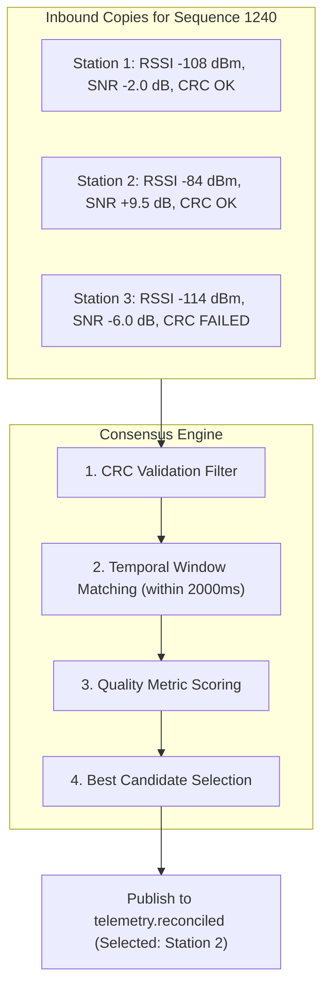

# Multi-Station Reconciliation Algorithm

## 1. Problem: Multi-Receiver Redundancy

When five ground stations receive the identical 1-Hz [LoRa](/guide/glossary#lora) transmission from the balloon, five copies enter the cloud ingress gateway with varying timestamps, [Signal-to-Noise Ratios (SNR)](/guide/glossary#snr), and [Received Signal Strength Indicators (RSSI)](/guide/glossary#rssi).



---

## 2. Scoring & Selection Function

For every packet group sharing the same sequence counter:

1. **[CRC Checksum Filter](/guide/glossary#crc)**: Any packet where `crc_valid == false` is filtered out of the consensus pool.
2. **Quality Score (Q) Calculation**:
   ```text
   Q = (0.60 * SNR) + (0.30 * RSSI_norm) + (0.10 * ValidFieldCount)
   ```
   - **SNR Weight (60%)**: Highest priority given to high signal-to-noise ratio.
   - **RSSI Weight (30%)**: Secondary weight given to raw signal strength.
   - **Field Integrity (10%)**: Tiebreaker given to packets with all sensor channels intact.

3. **[Consensus Ledger Update](/guide/glossary#append-only-storage)**: The highest-scoring candidate is written to `reconciliation_ledger` with the `best_packet_id` pointer. All original raw packets remain unmodified in `packets_raw`.
