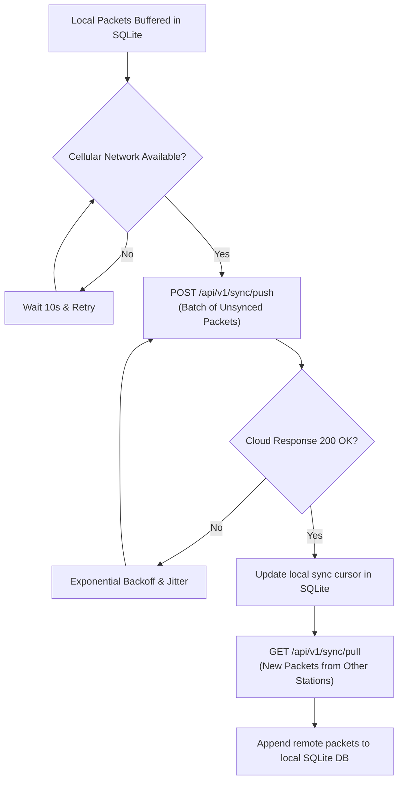

# Station-to-Cloud Synchronization

## 1. Network Philosophy: Intermittent & Stateless

Because field recovery vehicles travel through rural and mountainous areas with unpredictable cellular reception, the synchronization protocol is strictly **stateless, batch-oriented, and [idempotent](/guide/glossary#idempotency)**.



---

## 2. API Endpoints

### 1. `POST /api/v1/sync/push`
Transfers a batch of newly captured raw and decoded packets from the local station to the cloud.

**Payload Request:**
```json
{
  "station_id": "station-alpha-mobile",
  "sync_batch_id": "batch-1718293810",
  "packets": [
    {
      "local_id": 1042,
      "timestamp_ns": 1718293809123456789,
      "raw_hex": "AA55180102030405...",
      "rssi_dbm": -92,
      "snr_db": 8.5,
      "crc_valid": true,
      "decoded": {
        "lat": 6.9271,
        "lon": 79.8612,
        "alt_m": 24510.5,
        "ascent_mps": 5.2,
        "pressure_hpa": 28.4
      }
    }
  ]
}
```

**Response (200 OK):**
```json
{
  "status": "ACCEPTED",
  "received_count": 1,
  "cloud_high_water_mark": 8421
}
```

---

### 2. `GET /api/v1/sync/pull?since_seq=<seq>`
Retrieves packets captured by *other* ground stations using a [High-Water Mark](/guide/glossary#high-water-mark) cursor.
- Enables a recovery team vehicle returning into cell range to immediately receive tracking updates that fixed launch antennas captured while the vehicle was in a cellular dead zone.
