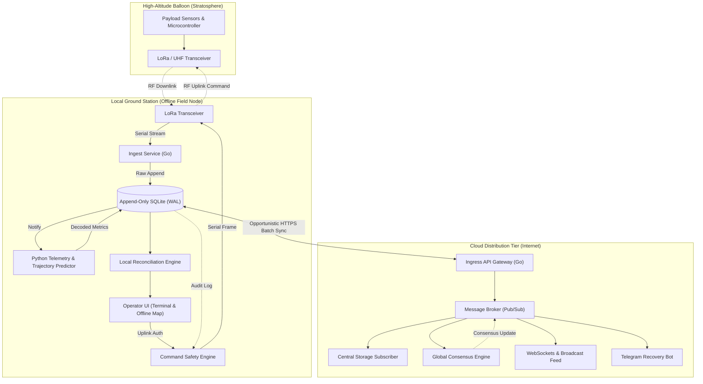
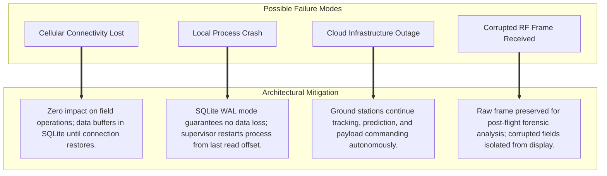

# End-to-End System Architecture

## 1. High-Level Architecture

The Serendib HAB platform operates across two distinct domains: the **Local Field Tier** (autonomous ground stations) and the **Cloud Tier** (centralized telemetry distribution).

---

## 2. Network Boundaries & Protocols

| Network Domain | Protocol | Reliability & Characteristics | Glossary Reference |
|---|---|---|---|
| **Payload to Ground (Downlink)** | [LoRa](/guide/glossary#lora) RF / FSK | Long-range radio broadcast reaching 200+ km line-of-sight. | [LoRa Technology](/guide/glossary#lora) |
| **Ground to Payload (Uplink)** | Authenticated [LoRa](/guide/glossary#lora) Frame | Deliberate, [HMAC-signed](/guide/glossary#hmac) command pulses with [CRC verification](/guide/glossary#crc). | [HMAC Signatures](/guide/glossary#hmac) |
| **Local Internal IPC** | [SQLite WAL File I/O](/guide/glossary#wal-mode) | Fast local inter-process communication protected against field power loss. | [SQLite WAL Mode](/guide/glossary#wal-mode) |
| **Station to Cloud Sync** | [Idempotent](/guide/glossary#idempotency) HTTPS Batch | Opportunistic cellular/satellite backhaul with [high-water mark](/guide/glossary#high-water-mark) tracking. | [Idempotency](/guide/glossary#idempotency) |
| **Cloud Internal Services** | [Message Broker](/guide/glossary#message-broker) (Pub/Sub) | Low-latency, durable intra-cloud message distribution. | [Message Broker](/guide/glossary#message-broker) |

---

## 3. Failure Domain Analysis

