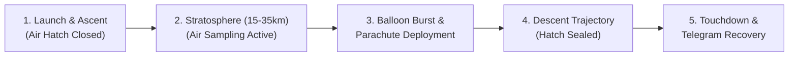
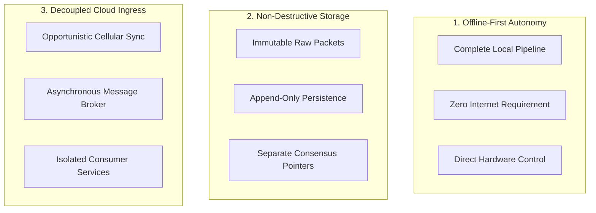
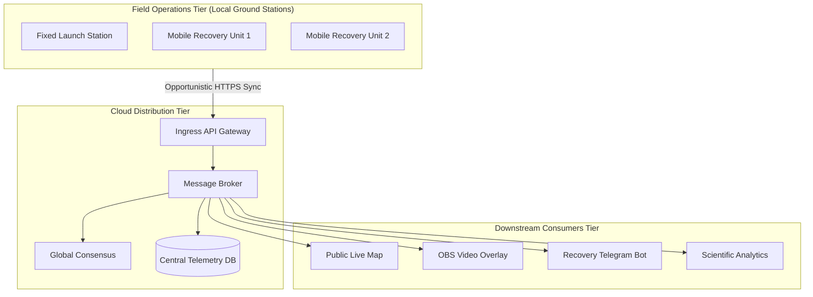

# Project Proposal and System Overview

## 1. Mission Context and Operational Profile

A High-Altitude Balloon (HAB) flight train connects the helium balloon at the top, a parachute in the middle, and the scientific sensor payload at the bottom. The payload includes an active motorized **[Air Intake Door](/guide/glossary#air-intake-door)** for controlled stratospheric air sampling.

During this multi-hour mission, continuous tracking and uplink commanding are critical. However, field operations introduce severe operational challenges:

- **Harsh & Remote Environments**: Field recovery teams track the payload into dense forests, deserts, or mountainous regions where cellular connectivity is intermittent or completely absent.
- **Multi-Receiver Diversity**: Several stationary antennas (launch site, tracking towers) and mobile tracking units (recovery vehicles) capture transmissions simultaneously with differing signal strengths.
- **Decoupled Data Distribution**: Mission controllers, field recovery teams, public live streams, and post-flight scientists all require live telemetry without burdening radio hardware or field computing nodes.

---

## 2. Core Architectural Philosophy

The Serendib Ground Station Architecture is built on three governing principles:

### 2.1 [Offline-First](/guide/glossary#offline-first) Autonomy
Every ground station is a self-contained computing system. Reception, timestamping, decoding, trajectory modeling, offline mapping, and uplink commanding function with 100% fidelity without an active internet connection.

### 2.2 [Append-Only (Non-Destructive) Storage](/guide/glossary#append-only-storage)
No telemetry frame is ever overwritten, altered, or deleted to resolve duplicate reception across stations. All raw byte streams are preserved in immutable append-only storage. [Reconciliation](/guide/glossary#reconciliation) decisions are recorded in a separate audit ledger referencing the original raw records.

### 2.3 Decoupled Cloud Synchronization via a [Message Broker](/guide/glossary#message-broker)
Field stations synchronize opportunistically over cellular or satellite links. The cloud architecture uses a message broker to isolate ingestion from downstream microservices (public dashboard, broadcast overlays, Telegram recovery alerts), ensuring downstream spikes never degrade station synchronization.

---

## 3. Subsystem Breakdown

---

## 4. Documentation Outline

This engineering suite is organized into four sequential parts:

1. **[Part I: Architecture & Foundations](/guide/overview)**: Mission context, [End-to-End Architecture](/guide/architecture-overview), and the centralized [System Vocabulary & Glossary](/guide/glossary).
2. **[Part II: Local Ground Station (Edge Tier)](/local-station/)**: Autonomous [Pipeline Architecture](/local-station/), [Radio Ingest](/local-station/radio-ingest), [SQLite WAL Storage](/local-station/storage-engine), [Trajectory Prediction](/local-station/processing-prediction), [Command Safety & Interlocks](/local-station/command-safety), and [Operator Interfaces](/local-station/user-interfaces).
3. **[Part III: Cloud Platform (NATS JetStream Tier)](/cloud-platform/)**: [Cloud Architecture](/cloud-platform/), [Station Sync Protocol](/cloud-platform/station-sync), [NATS JetStream Broker](/cloud-platform/message-broker), [Consensus & Reconciliation](/cloud-platform/reconciliation), and [Downstream Gateways & Telegram Bot](/cloud-platform/downstream-services).
4. **[Part IV: Hardware & Data Specifications](/specs/telemetry-packet-format)**: [Binary Telemetry Packet Format (32-Byte)](/specs/telemetry-packet-format) and [Relational Database Schema & DDL](/specs/database-schema).
