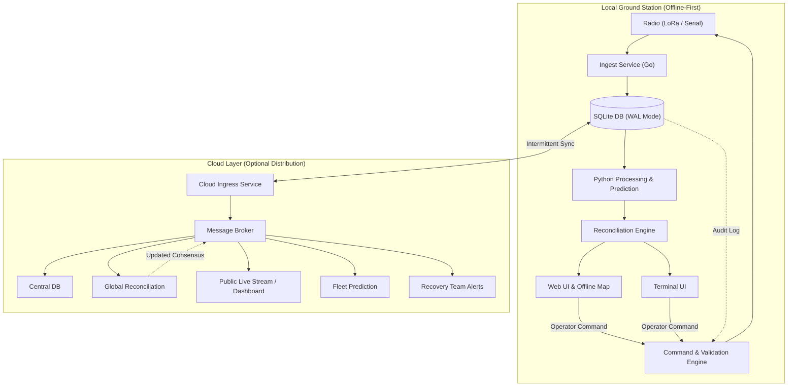

## System Architecture

## Documentation Outline

| Part | Engineering Tier | Chapter Highlights |
|---|---|---|
| [**Part I: Architecture & Foundations**](/guide/overview) | High-Level Design | [1. Mission Overview & Flight Profile](/guide/overview) [2. End-to-End System Architecture](/guide/architecture-overview) [3. System Vocabulary & Glossary](/guide/glossary) |
| [**Part II: Local Ground Station**](/local-station/) | Edge & Field Pipeline | [4. Pipeline Overview & State Machine](/local-station/) [5. Radio Ingestion & Framing](/local-station/radio-ingest) [6. SQLite WAL Storage Engine](/local-station/storage-engine) [7. Trajectory Prediction & Wind Models](/local-station/processing-prediction) [8. Command Safety & Interlocks](/local-station/command-safety) [9. Operator Interfaces (TUI & Web)](/local-station/user-interfaces) |
| [**Part III: Cloud Platform**](/cloud-platform/) | Aggregation & Messaging | [10. Cloud Subsystem Architecture](/cloud-platform/) [11. Station Sync Protocol](/cloud-platform/station-sync) [12. NATS JetStream Broker](/cloud-platform/message-broker) [13. Consensus & Reconciliation](/cloud-platform/reconciliation) [14. Downstream Gateways & Telegram Bot](/cloud-platform/downstream-services) |
| [**Part IV: Specifications**](/specs/telemetry-packet-format) | Hardware & DB Contracts | [15. Binary Telemetry Packet Format (32-Byte)](/specs/telemetry-packet-format) [16. Relational Database Schema & DDL](/specs/database-schema) |
