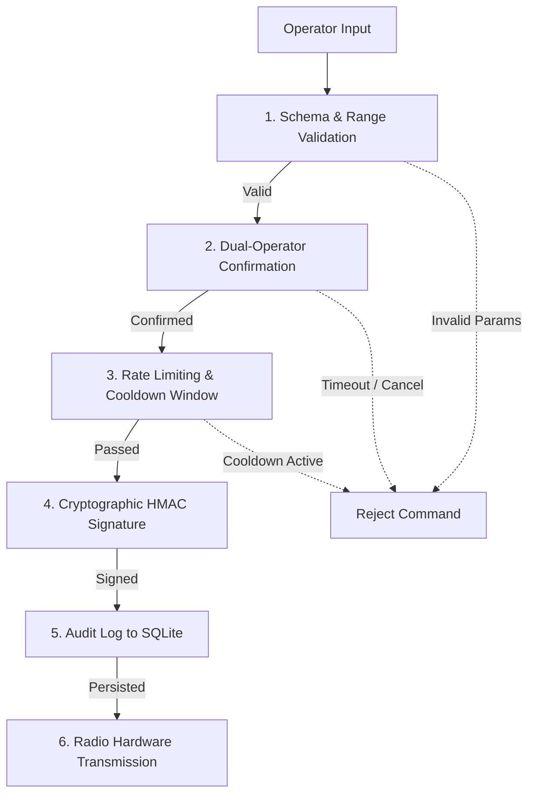

# Command & Control Safety Engine

## 1. Safety Rationale & Threat Model

Transmitting uplink commands to a high-altitude balloon (such as triggering an emergency nichrome cutdown wire to separate the payload from the balloon) carries mission-ending risk if triggered accidentally or maliciously.



---

## 2. Multi-Stage Verification Pipeline

### Stage 1: Schema & Parameter Validation
Commands are strictly checked for valid parameter boundaries:
- `AIR_INTAKE_DOOR_OPEN`: Opens the payload [Air Intake Door](/guide/glossary#air-intake-door) for atmospheric sampling. Requires `duration_sec` (1 to 300 seconds).
- `AIR_INTAKE_DOOR_CLOSE`: Closes and seals the air sampling hatch.
- `CUTDOWN_TRIGGER`: Separates the payload from the balloon train. Requires pulse duration parameter (0 to 10 seconds).
- `PING_BEACON`: Telemetry ping frequency parameter.
- `SET_TRANSMIT_POWER`: Permissible RF power levels (2 dBm to 22 dBm).

### Stage 2: [Dual-Confirmation Handshake](/guide/glossary#dual-confirmation)
Any command flagged as irreversible or mission-critical requires an explicit two-step operator confirmation within a 15-second window:

**Example 1: Air Intake Sampling Hatch Control**
```text
[Operator] > door-open --duration=120
[System]   > Notice: Opening atmospheric air intake hatch for 120 seconds.
[System]   > Type 'CONFIRM-DOOR-120' within 15 seconds to execute:
[Operator] > CONFIRM-DOOR-120
[System]   > Command authorized. Transmitting signed uplink frame...
```

**Example 2: Flight Train Cutdown Wire**
```text
[Operator] > cutdown --duration=5
[System]   > WARNING: Cutdown will separate the flight train from the balloon!
[System]   > Type 'CONFIRM-CUTDOWN-5S' within 15 seconds to transmit:
[Operator] > CONFIRM-CUTDOWN-5S
[System]   > Cutdown authorized. Signing and transmitting...
```

### Stage 3: Rate Limiting & [Replay Protection](/guide/glossary#replay-protection)
- **Cooldown Window**: Prevents double-transmission within 30 seconds for state-changing commands.
- **[Monotonic Sequence Numbers](/guide/glossary#replay-protection)**: The balloon payload rejects any command containing a sequence counter less than or equal to the last received command.

### Stage 4: [Cryptographic HMAC Signature](/guide/glossary#hmac)
Uplink packets are authenticated with a pre-shared key (PSK) using HMAC-SHA256 truncated to 4 bytes:

```text
[Sequence Index (2B) | Command ID (1B) | Payload Data (Variable) | HMAC-SHA256 (4B)]
```

### Stage 5: Immutable Audit Logging
Before passing bytes to the radio UART interface, the command is synchronously logged into `commands_log` in the local [SQLite database](/guide/glossary#wal-mode).
