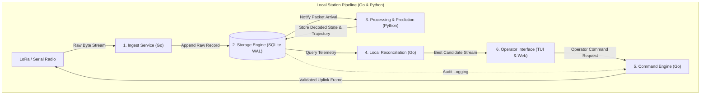
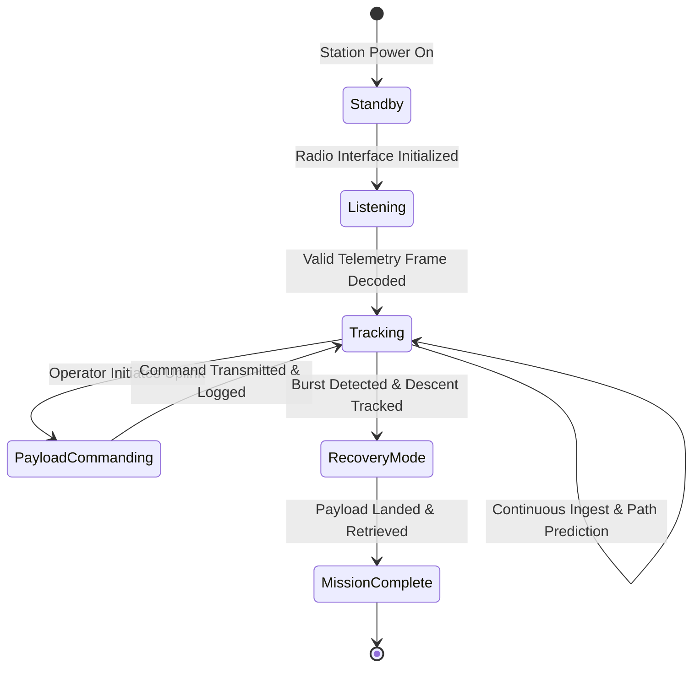

# Local Ground Station Architecture

## 1. Subsystem Overview

The Local Ground Station is an autonomous hardware-software unit designed to operate unattended at fixed tracking sites or inside mobile recovery vehicles.

---

## 2. Pipeline Stages

| Stage | Subsystem | Responsibility |
|---|---|---|
| **1. Ingest** | [Radio Ingest Service](./radio-ingest.md) | Reads serial bytes from LoRa/SDR hardware, attaches monotonic nanosecond timestamps, and pushes to storage without blocking. |
| **2. Storage** | [Storage Engine (SQLite)](./storage-engine.md) | Crash-safe append-only persistence using SQLite in WAL mode. Protects against sudden field power cuts. |
| **3. Processing** | [Processing & Trajectory Prediction](./processing-prediction.md) | Parses binary frames into sensor metrics (GPS, altitude, pressure, temp) and computes landing prediction ellipses via Python. |
| **4. Reconciliation** | [Local Reconciliation](./storage-engine.md#reconciliation) | Selects the highest-SNR packet when multiple reception paths exist. |
| **5. Command** | [Command Safety Engine](./command-safety.md) | Enforces authentication, rate limits, operator dual-confirmation, and pre-transmission safety checks for payload uplinks. |
| **6. Display** | [Operator User Interfaces](./user-interfaces.md) | Real-time dual display: High-density Terminal UI (TUI) for quick monitoring and browser-based offline interactive map. |

---

## 3. Operational State Machine

