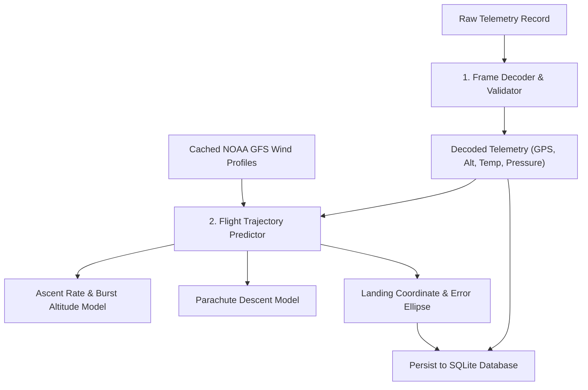
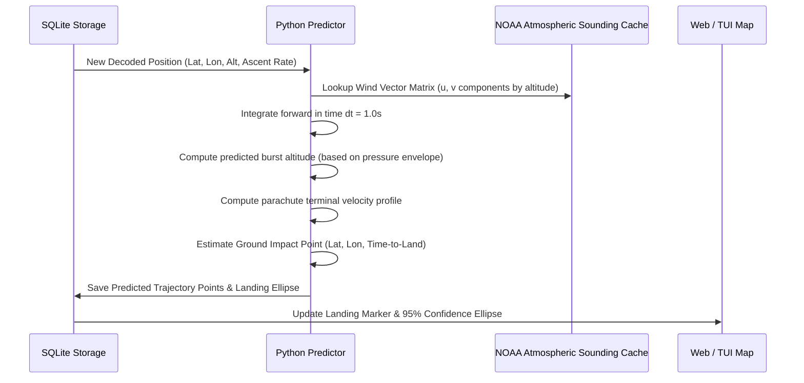

# Processing & Trajectory Prediction

## 1. Overview

The Processing & Trajectory Prediction subsystem is implemented in **Python** to leverage scientific numerical computing libraries (NumPy, SciPy) and enable rapid calibration of atmospheric models.



---

## 2. Telemetry Decoding Pipeline

1. **Header Validation**: Validates preamble, magic bytes, and frame sequence continuity.
2. **Bitfield Unpacking**: Converts binary byte arrays into IEEE-754 floating-point coordinates, barometric pressure, and temperature readings.
3. **Sensor Sanity Checks**: 
   - GPS coordinate bounding (latitude: -90° to +90°, longitude: -180° to +180°).
   - Rate-of-climb anomaly detection (rejecting single-frame multi-kilometer altitude spikes).
   - Isolating corrupted sensor channels (a failed thermistor does not discard valid GPS coordinates).

---

## 3. Flight Path & Landing Prediction Model



### Mathematical Integration:

```text
x(t + Δt) = x(t) + v_wind(z) * Δt
z(t + Δt) = z(t) + v_z(z) * Δt
```

- **Vertical velocity (v_z) during ascent**: Computed dynamically from a running 60-second moving average of barometric and GPS altitude deltas.
- **Vertical velocity (v_z) during parachute descent**: Modeled via atmospheric air density (rho(z)):
```text
v_descent(z) = sqrt( (2 * m * g) / (rho(z) * Cd * A) )
```
