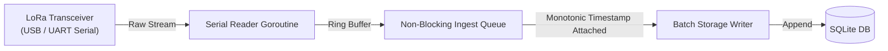
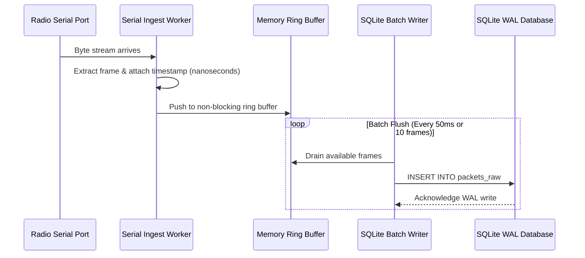

# Radio Ingest Service

## 1. Responsibility and Design Goals

The Radio Ingest Service is the software bridge between the physical radio receiver ([LoRa](/guide/glossary#lora) transceiver or Software-Defined Radio) and the local ground station pipeline.



### Core Engineering Requirements:
- **Zero Frame Drops**: Telemetry frames arrive over radio bursts. The ingest service uses a [Memory Ring Buffer](/guide/glossary#ring-buffer) so it never blocks or drops frames during computer hard drive writes.
- **Precision Timestamping**: Attaches both a monotonic clock and UTC timestamp immediately upon reading bytes from the serial buffer.
- **Fail-Safe Isolation**: Corrupted or incomplete frames are preserved for diagnostic analysis without interrupting the receiver.

---

## 2. Hardware Interfacing & Serial Protocol

### Supported Hardware:
1. **[LoRa Transceiver](/guide/glossary#lora) (Standard)**: SX1262 / SX1276 modules connected via USB-UART serial bridge (baud rate: 115200).
2. **Software-Defined Radio (SDR)**: RTL-SDR capturing auxiliary amateur APRS beacons.

### Frame Layout & [CRC Checksum](/guide/glossary#crc)
```text
+----------+------------+------------+---------------+----------+----------+
| Preamble | Frame Sync | Packet Len | Payload Bytes | Checksum | Postamble|
| (4 Byte) | 0xAA 0x55  |  (1 Byte)  | (Variable)    | CRC-16   | 0x0D 0x0A|
+----------+------------+------------+---------------+----------+----------+
```

---

## 3. Ingest Concurrency & Queue Architecture



### [Memory Ring Buffer](/guide/glossary#ring-buffer) Design
If a disk write stalls during an operating system flush, an in-memory circular buffer holds up to 4,096 frames in RAM, preventing telemetry loss during critical flight events like balloon burst or touchdown.
