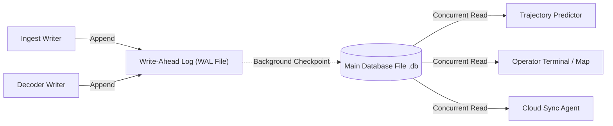
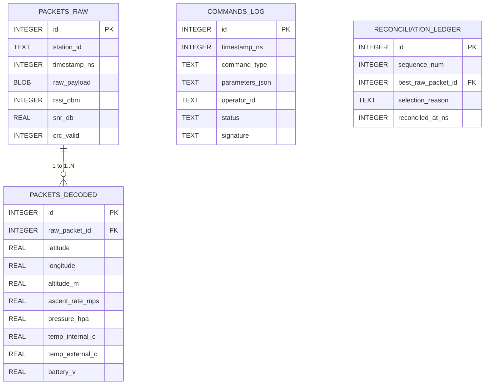

# Local Storage Engine (SQLite WAL)

## 1. Storage Architecture

The local storage subsystem uses **SQLite** in **[WAL (Write-Ahead Logging) Mode](/guide/glossary#wal-mode)**. It provides atomic, [Append-Only Persistence](/guide/glossary#append-only-storage) on unattended field computers with zero external database server dependencies.



---

## 2. WAL Mode Configuration & Pragmas

When the storage engine initializes, it applies the following settings to ensure field reliability:

```sql
-- Enable Write-Ahead Logging for concurrent readers and writer
PRAGMA journal_mode = WAL;

-- Balance durability and disk write latency (survives process crash)
PRAGMA synchronous = NORMAL;

-- Enforce UTF-8 encoding
PRAGMA encoding = "UTF-8";

-- Set busy timeout to prevent locking conflicts
PRAGMA busy_timeout = 5000;

-- Auto-checkpoint when WAL reaches 1000 pages (~4MB)
PRAGMA wal_autocheckpoint = 1000;
```

---

## 3. Database Schema Overview



---

## 4. Crash Recovery & [Idempotency](/guide/glossary#idempotency)

1. **Sudden Power Cut Resilience**: Because writes go sequentially to the WAL log file, a sudden battery disconnection leaves the database intact. Upon reboot, SQLite recovers uncheckpointed WAL frames automatically.
2. **Deterministic Replay via [High-Water Marks](/guide/glossary#high-water-mark)**: If the Python processing engine restarts, it queries `MAX(raw_packet_id)` from `packets_decoded` and resumes processing from that high-water mark without losing or duplicating historical frames.
