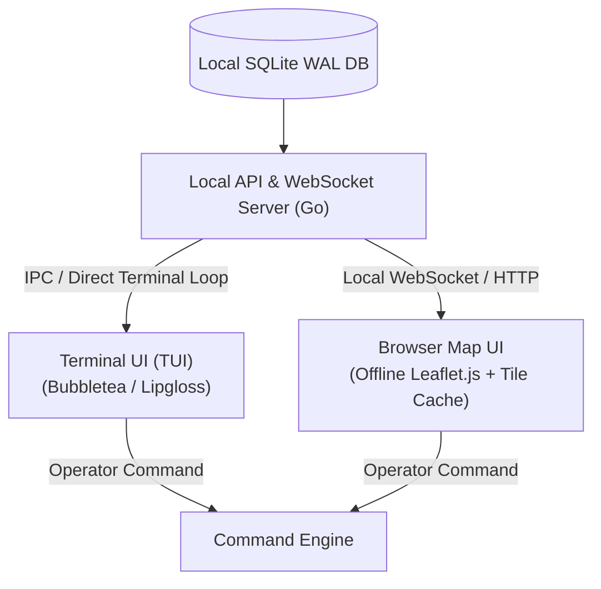

# Operator User Interfaces (TUI & Web)

## 1. Dual Interface Strategy

The ground station provides two decoupled presentation interfaces consuming data from the same local SQLite database:

---

## 2. Terminal Interface (TUI)

Designed for rapid deployment on headless laptops, ruggedized field tablets, or SSH remote sessions without requiring a graphical desktop environment.

### Key Capabilities:
- **Telemetry Teleprompter**: High-refresh text grid showing altitude, coordinates, ascent rate, pressure, internal/external temperatures, and battery levels.
- **RF Health Gauge**: Real-time RSSI and SNR bar graphs updating with every received frame.
- **Command Prompt**: Interactive keyboard-driven command console with tab-completion and confirmation modals.

---

## 3. Web Map Interface (Offline Capable)

Designed for tracking recovery vehicles and reviewing balloon trajectories on an interactive 2D map.

### Key Capabilities:
- **Pre-Cached Map Tiles**: Uses local OpenStreetMap raster tiles pre-downloaded along the flight corridor (zooms 6–15) so the map operates with zero internet access.
- **Historical Track & Vector**: Color-coded altitude polyline displaying the ascent and descent path.
- **Landing Probability Ellipse**: Dynamic visual polygon indicating the 95% confidence landing zone calculated by the trajectory prediction engine.
- **Station Self-Positioning**: Uses the laptop/tablet's onboard GPS or manual coordinates to render recovery vehicle distance, bearing, and line-of-sight elevation angle.
